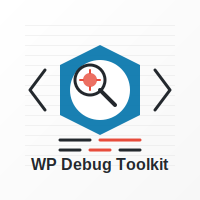

# 🛠️ WordPress Debug Toolkit


<p align="center">
  
</p>

<p align="center">
    Une suite complète d'outils de débogage et d'analyse pour WordPress et Elementor.
</p>

---
## 📋 Table des matières

- [🌟 Présentation](#-présentation)
- [✨ Fonctionnalités](#-fonctionnalités)
- [📥 Installation](#-installation)
- [🔧 Configuration](#-configuration)
- [📚 Documentation](#-documentation)
- [🧰 Outils inclus](#-outils-inclus)
- [❓ FAQ](#-faq)
- [🤝 Support et contribution](#-support-et-contribution)
- [📝 Licence](#-licence)
- [🙏  Remerciements](#-remerciements)

---

## 🌟 Présentation

**WordPress Debug Toolkit** est un plugin conçu pour les développeurs et administrateurs de sites WordPress qui ont besoin d'outils avancés pour déboguer, auditer et optimiser leurs sites WordPress.

Que vous cherchiez à comprendre comment sont utilisés les blocs Elementor sur votre site, à analyser les performances des requêtes SQL, ou à nettoyer votre bibliothèque de médias, ce plugin tout-en-un vous offre une suite complète d'outils intégrés à l'interface d'administration WordPress.

> 💡 **Conçu pour les développeurs par des développeurs** - Ce plugin respecte les meilleures pratiques de WordPress et utilise ses API natives pour garantir compatibilité et performances.

---

## ✨ Fonctionnalités

- 🔍 **Interface unifiée** - Tous les outils accessibles depuis un tableau de bord central
- 🚀 **Performance optimisée** - Analyse asynchrones pour ne pas ralentir votre site
- 🧩 **Modulaire** - Activez uniquement les outils dont vous avez besoin
- 🔄 **Mises à jour régulières** - Nouvelles fonctionnalités et améliorations fréquentes
- 🛡️ **Sécurisé** - Restrictions d'accès basées sur les capacités WordPress
- 📱 **Responsive** - Interface adaptée à tous les appareils, y compris mobiles et tablettes
- 🌐 **Multi-langue** - Support complet pour les traductions (actuellement disponible en Français et Anglais)
- 📊 **Exports de données** - Téléchargez vos analyses au format CSV ou JSON

---

## 📥 Installation

### 📦 Méthode standard

1. Téléchargez l'archive ZIP du plugin
2. Connectez-vous à votre administration WordPress
3. Allez dans **Extensions -> Ajouter**
4. Cliquez sur **Téléverser une extension**
5. Sélectionnez le fichier ZIP téléchargé
6. Cliquez sur **Installer maintenant**
7. Activez le plugin une fois l'installation terminée

### ⚡ Via Composer

```bash
composer require cedricbb/wp-debug-toolkit
```

### 🔄 Via Git

```bash
cd wp-content/plugins
git clone https://github.com/cedricbb/wp-debug-toolkit.git
```

---

## 🔧 Configuration

Après activation, accédez au nouveau menu **Debug Toolkit** dans votre tableau de bord WordPress.

### ⚙️ Paramètres généraux

- **Restrictions d'accès** - Définissez quels rôles peuvent utiliser les outils
- **Journalisation** - Activez-désactivez l'enregistrement des actions de débogage
- **Mode développeur** - Fonctionnalités supplémentaires pour les environnements de développement

### 🔌 Activation des modules

Chaque outil peut être activé/désactivé individuellement selon vos besoins :

| Outil                            | Description                              | Impact sur les performances |
|----------------------------------|------------------------------------------|-----------------------------|
| 🧱 Analyseur de blocs Elementor  | Analyse l'utilisation des widgets        | Faible                      |
| 📝 Analyseur de formulaires      | Examine la configuration des formulaires | Faible                      |
| 🌐 Moniteur d'API                | Surveille les appels API                 | Moyen                       |
| 🖼️ Nettoyeur de médias          | Identifie les médias inutilisés          | Moyen                       |
| 🔗 Inspecteur de hooks           | Visualise les actions et filtres         | Moyen                       |
| 📊 Profileur SQL                 | Analyse les requêtes SQL                 | Élevé                       |
| 💾 Inspecteur de cache           | Examine les données en cache             | Faible                      |
| ⏱️ Moniteur de cron              | Surveille les tâches planifiées          | Faible                      |

---

## 📚 Documentation

### 📖 Guide d'utilisation

Consultez notre [guide détaillé](https://github.com/cedricbb/wp-debug-toolkit/wiki) pour des instructions complètes sur l'utilisation de chaque outil.

### 🧪 Exemples d'utilisation

```php
// Accès programmatique à l'analyseur de blocs Elementor
$block_analyzer = Elementor_Block_Analyzer::init();
$results = $block_analyzer->analyze_site();
```

---

## 🧰 Outils inclus

### 🧱 Analyseur de blocs Elementor

Cet outil puissant scanne votre site pour identifier tous les widgets Elementor utilisés et sur quelles pages ils apparaissent.

**Fonctionnalités :**
- 📊 Vue d'ensemble de l'utilisation des widgets
- 🔍 Recherche de widgets spécifiques
- 📑 Liste des pages utilisant chaque widget
- 📤 Export des résultats

<details>
    <summary><b>Capture d'écran</b></summary>
    
</details>

### 📝 Analyseur de formulaires Elementor (à venir)

Examinez  en détail tous les formulaires Elementor de votre site, y compris leurs champs, validations et actions après soumission.

**Fonctionnalités :**
- 📋 Inventaire complet des formulaires
- 🔢 Détails des champs et validations
- 📨 Configuration des e-mails et redirections
- 🔄 Aperçu des actions personnalisées

### 🌐 Moniteur d'API (à venir)

Surveillez et analysez tous les appels API entrants et sortants de site WordPress.

**Fonctionnalités :**
- 📡 Journal des appels API REST
- ⏱️ Temps de réponse et performances
- 🔍 Filtrage par endpoint
- ❌ Détection des erreurs

### 🖼️ Nettoyeur de médias (à venir)

Identifiez et gérez les fichiers médias inutilisés dans votre bibliothèque WordPress.

**Fonctionnalités :**
- 🔍 Détection des médias orphelins
- 📏 Analyse de l'espace disque utilisé
- 🗑️ Suppression sécurisée ou archivage
- 🔄 Régénération des miniatures

### 🔗 Inspecteur de hooks (à venir)

Visualisez toutes les actions et filtres WordPress actifs, leur ordre d'exécution et leur origine.

**Fonctionnalités :**
- 📊 Vue hiérarchique des hooks
- 🔍 Recherche par nom de hook
- 📝 Détails sur les callbacks associés
- 🧩 Provenance des hooks (core, thème, plugin)

### 📊 Profileur de requêtes SQL (à venir)

Analysez les performances des requêtes SQL de votre site pour identifier les goulots d'étranglement.

**Fonctionnalités :**
- ⏱️ Temps d'exécution des requêtes
- 🔄 Fréquence d'appel
- 📉 Identification des requêtes lentes
- 💡 Suggestions d'optimisation

### 💾 Inspecteur de cache (à venir)

Examinez les objets en cache, leur durée de vie et leur taille.

**Fonctionnalités :**
- 📦 Vue d'ensemble des objets mis en cache
- ⏲️ Informations sur l'expiration
- 📏 Taille des données en cache
- 🧹 Nettoyage sélectif du cache

### ⏱️ Moniteur de cron WordPress (à venir)

Surveillez et gérez les tâches planifiées (cron jobs) de WordPress.

**Fonctionnalités :**
- 📅 Calendrier des tâches planifiées
- ⏰ Prochaines exécutions
- 📜 Historique des exécutions
- 🔄 Exécution manuelle des tâches

---

## ❓ FAQ

<details>
    <summary><b>🔒 Ce plugin est-il sécurisé à utiliser en production ?</b></summary>
Oui, mais avec précaution. Le plugin est conçu avec la sécurité à l'esprit, mais certains outils peuvent avoir un impact sur les performances s'ils
sont activés en permanence. Nous recommandons de :<br>
- Limiter l'accès aux administrateurs uniquement<br>
- Désactiver les outils non utilisés<br>
- Utiliser le mode de journalisation minimal en production
</details>

<details>
    <summary><b>🌐 Puis-je utiliser ce plugin sur un site multisite ?</b></summary>
Oui, le plugin est compatible avec les installations multisite de WordPress. Vous pouvez le configurer réseau par réseau ou globalement.
</details>

<details>
    <summary><b>💻 Quelles sont les exigences techniques ?</b></summary>
- Wordpress 5.9 ou supérieur<br>
- PHP 7.4 ou supérieur<br>
- Extensions PHP : JSON, MySQLi, libxml<br>
- Droits d'administration sur WordPress<br>
- Si vous utilisez les outils Elementor : Elementor 3.5 ou supérieur
</details>

<details>
    <summary><b>🔄 À quelle fréquence le plugin est-il mis à jour ?</b></summary>
Le plugin est mis à jour régulièrement pour ajouter de nouvelles fonctionnalités, améliorer les performances et corriger les bugs. Nous recommandons de vérifier les mises à jour toutes les 2-3 semaines.
</details>

---

## 🤝 Support et contribution

### 🐞 Signaler un bug

Si vous trouvez un bug, veuillez le signaler en [créant une issue](https://github.com/cedricbb/wp-debug-toolkit/issues) sur GitHub avec les détails suivants :
- Version de Wordpress<br>
- Version du plugin<br>
- Description détaillée du problème<br>
- Étapes pour reproduire le bug<br>
- Captures d'écran (si pertinent)

### 💡 Suggérer une fonctionnalité

Vous avez une idée pour améliorer le plugin ? [Créez une issue](https://github.com/cedricbb/wp-debug-toolkit/issues) avec le tag "enhancement".

### 👨‍💻 Contribuer au code

Les contributions sont les bienvenues ! Pour contribuer :

1. Forkez le dépôt
2. Créez une branche pour votre fonctionnalité (`git checkout -b feature/ma-fonctionnalité`)
3. Committez vos changements (`git commit -m 'Ajout de ma fonctionnalité'`)
4. Poussez vers la branche (`git push origin feature/ma-fonctionnalité`)
5. Créez une nouvelle Pull Request

Veuillez suivre nos [directives de contribution](CONTRIBUTING.md) pour garantir une intégration fluide.

---

## 📝 Licence

Ce projet est sous licence GPL v2 ou ultérieure - voir le fichier [LICENSE](LICENSE) pour plus de détails.

---

## 🙏 Remerciements

- [WordPress](https://wordpress.org) pour leur incroyable CMS
- [Elementor](https://elementor.com) pour leur constructeur de pages révolutionnaire
- Tous les [contributeurs](https://github.com/cedricbb/wp-debug-toolkit/graphs/contributors) qui ont aidé à améliorer ce plugin

---

<p align="center">
    Fait avec ❤️ pour la communauté WordPress
</p>

<p align="center">
    <a href="https://github.com/cedricbb">GitHub</a> •
</p>